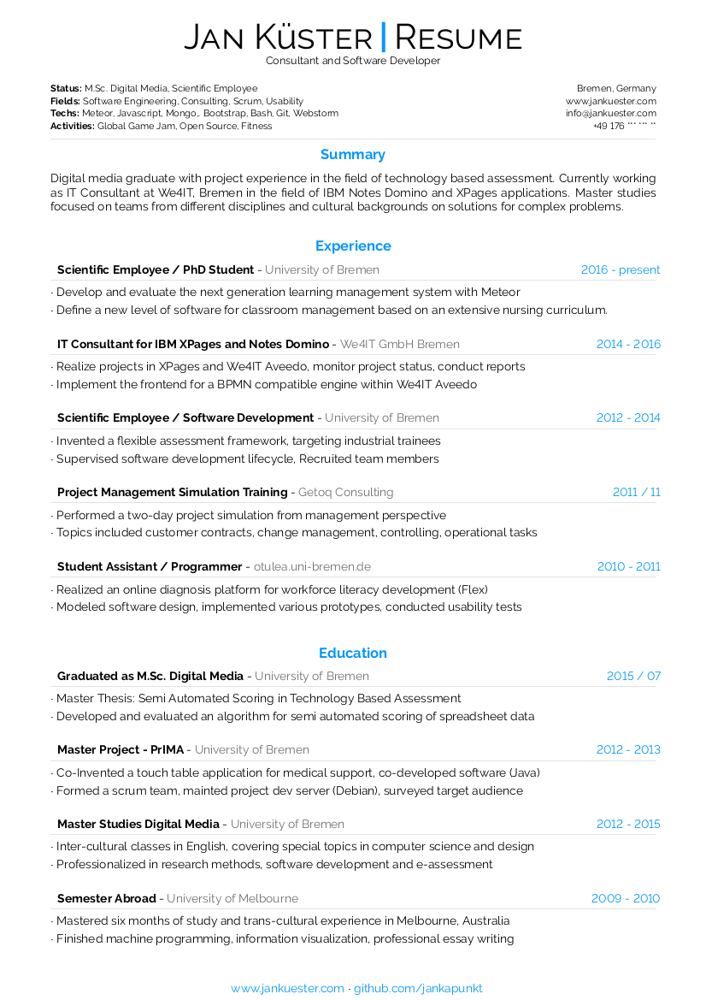
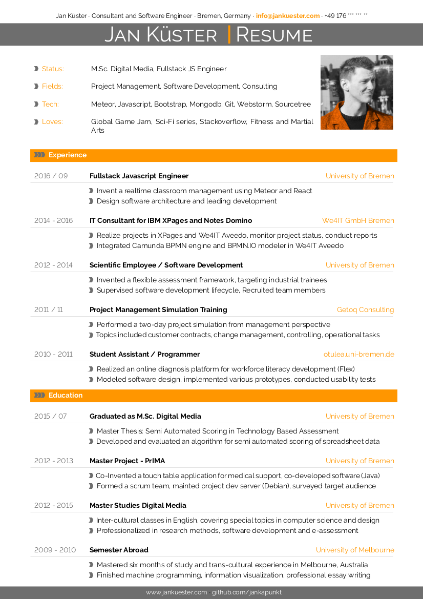
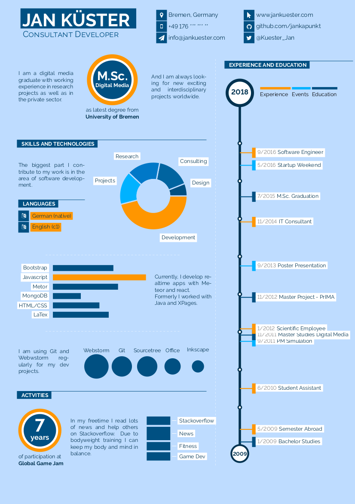
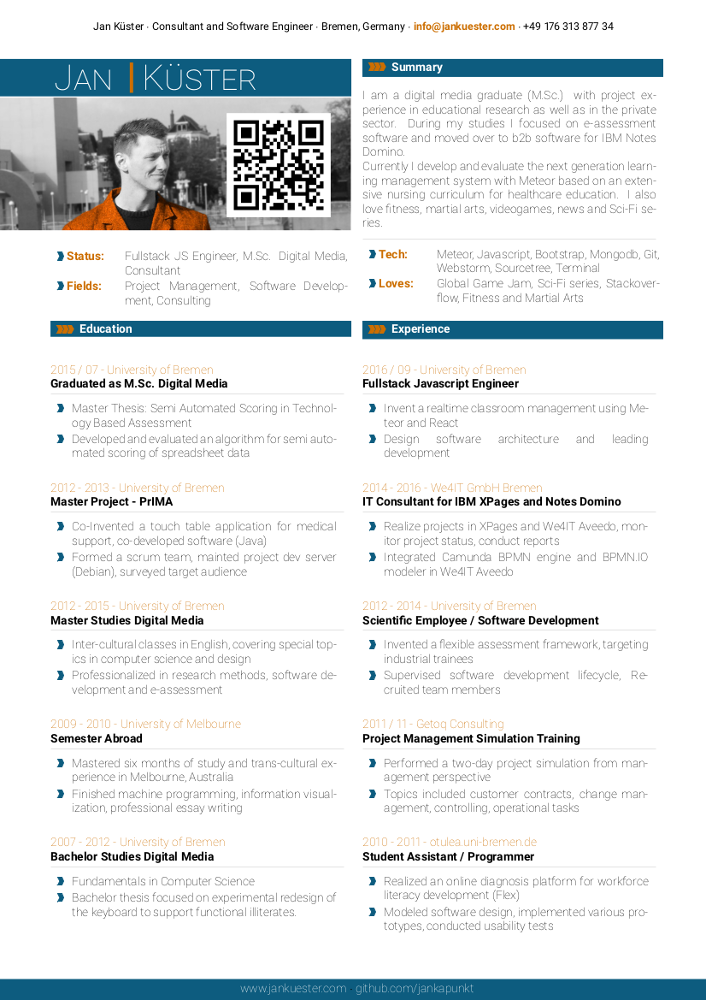
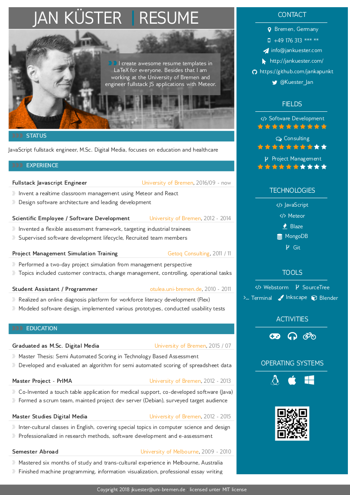
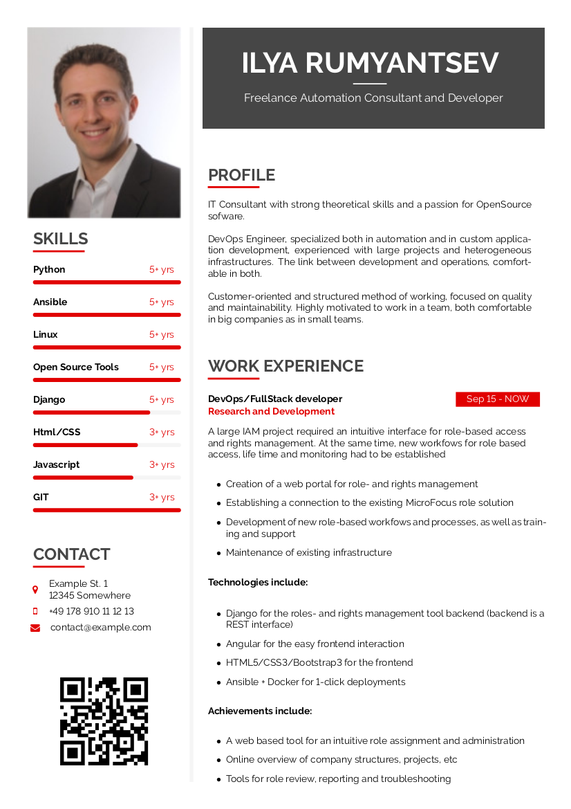

<h1 align="center">
  
   
  LaTex CV and Resume Collection
</h1>

  
  
  	

 
 

:necktie: A collection of simple and easy to use, yet powerful LaTeX templates for CVs and resumes. All of them are self designed and self implemented and not copied from template collections.

Now with support for Chinese, Japanese and Korean character encoding. Setup is only two lines of code! Read more <a href="docs/cjk/README.md">here</a>.

	
 

<table width="100%" margin-left="auto" margin-right="auto">
	<tr>
		<th>Classic</th>
		<th>Modern</th>
	</tr>
	<tr>
		<td width="50%">
			
		</td>
		<td width="50%">
			
		</td>
	</tr>
</table>

<table width="100%" margin-left="auto" margin-right="auto">
	<tr>
		<th>Infographics</th>
		<th>Two Columns</th>
	</tr>
	<tr>
		<td width="50%">
			
		</td>
		<td width="50%">
			
		</td>
	</tr>
</table>

<table>
    <tr>
       	<th>Sidebar</th>
       	<th>Row Layout</th>
    </tr>
    	<tr>	
    		<td width="50%">
    			
    		</td>
    		<td width="50%">
    		    
            </td>    	
    	</tr>
</table>

<table>
    <tr>
       	<th>Sidebar Left</th>
       	<th>More coming soon...</th>
    </tr>
    	<tr>	
    		<td width="50%">
    			
    		</td>
    		<td width="50%">
    			<h4>Your idea for a new template.</h4>
            </td>    	
    	</tr>
</table>

**Great first impression**

Point out with a progressive layout. Give decision makers and HR only the most important information about you on one single page.

**Beginner friendly**

Pick a template, replace the content, compile, done. If that's not enough you can easily customize colors, fonts and layout. The templates are documented directly in the code. 

**Minimal environment**

You need a minimal tex-live distribution to compile the templates. No XeTeX or LuaTeX required. No other SDKs or environments required.

## How to build?

The following guide just briefly describes the requirements and build procedure as there are many ways to install a LaTeX distribution on various OS. Please create an issue, if this part is not helpful.

**Build Requirements**

You will need some minimal Texlive distrubution (The full texlive distribution is nearly 2GB large but you will need only a part of it). A good starting point is here: https://www.latex-project.org/get/#tex-distributions

If you want to install texlive from tug.org instead, you can use this guide: https://tug.org/texlive/

Users of various Linux distrubutions can also install texlive from their repositories.

This repo also contains a `texlive.profile` file in the project root, that can be used to install the minimum required texlive packages when manually installing texlive.

**Build Procedure**

 * Clone or download this project. 
 * Change to a template folder, which contains a `main.tex` file do
 * Edit the `main.tex` according to your CV credentials, optionally change settings and colors etc.
 * Run `pdflatex` (build/compile) 
 - The `main.pdf` should show the output.

## Contribution

**Contributors are very welcome**. You want to contribute? Awesome! Please check the [contribution guidelines](https://github.com/jankapunkt/latexcv/blob/master/CONTRIBUTING.md) first to make it a success.

## License

The MIT License (MIT)

Copyright (c) 2014-2019 Jan Küster

Permission is hereby granted, free of charge, to any person obtaining a copy
of this software and associated documentation files (the "Software"), to deal
in the Software without restriction, including without limitation the rights
to use, copy, modify, merge, publish, distribute, sublicense, and/or sell
copies of the Software, and to permit persons to whom the Software is
furnished to do so, subject to the following conditions:
	
THE SOFTWARE IS PROVIDED "AS IS", WITHOUT WARRANTY OF ANY KIND, EXPRESS OR
IMPLIED, INCLUDING BUT NOT LIMITED TO THE WARRANTIES OF MERCHANTABILITY,
FITNESS FOR A PARTICULAR PURPOSE AND NONINFRINGEMENT. IN NO EVENT SHALL THE
AUTHORS OR COPYRIGHT HOLDERS BE LIABLE FOR ANY CLAIM, DAMAGES OR OTHER
LIABILITY, WHETHER IN AN ACTION OF CONTRACT, TORT OR OTHERWISE, ARISING FROM,
OUT OF OR IN CONNECTION WITH THE SOFTWARE OR THE USE OR OTHER DEALINGS IN
THE SOFTWARE.

