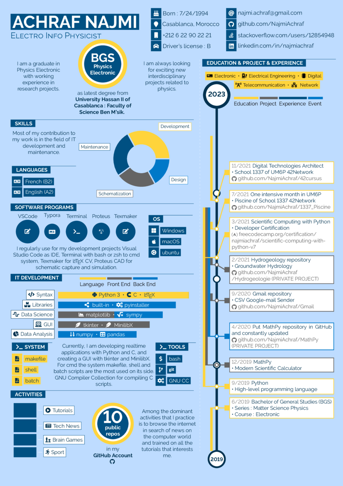

# Infographics 2

This infographics2 cv contains the following components:

* Piechart
* Bubbles for facts and enumerations
* Barchart for single category or multi category data
* Squares for same data as pie but other presentation
* Timeline for your cv history

All components can be easily customized/extended. See the parameter description on the various newcommand/newenvironment entries.

See the main.pdf file for example output.

The build does only relie on pdflatex and the packages, including the dependencies listet in the main readme.

### CV ENGLISH
  